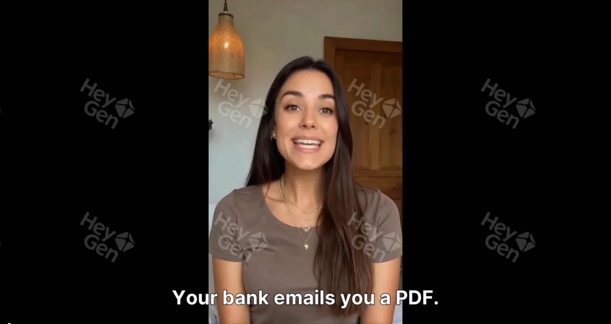
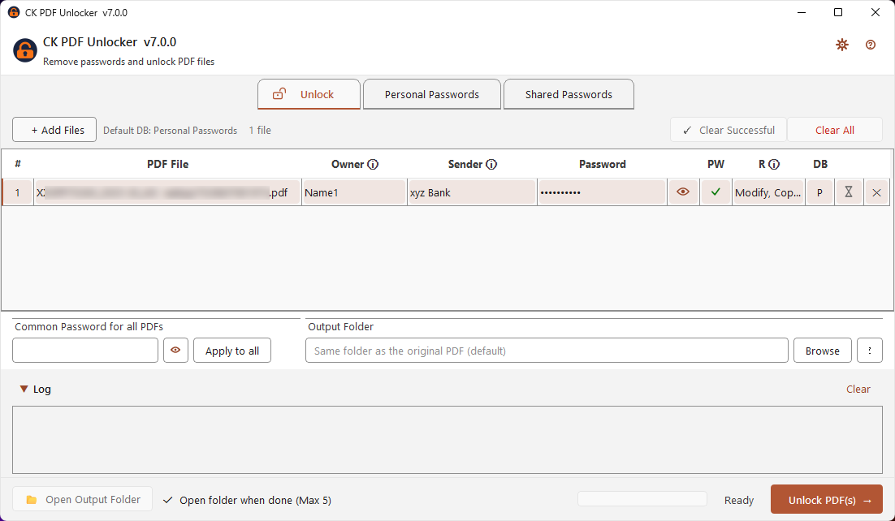
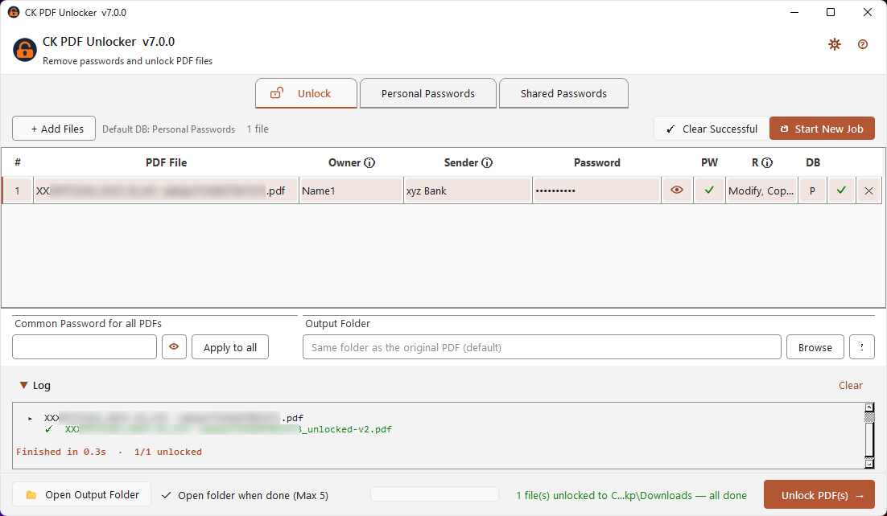
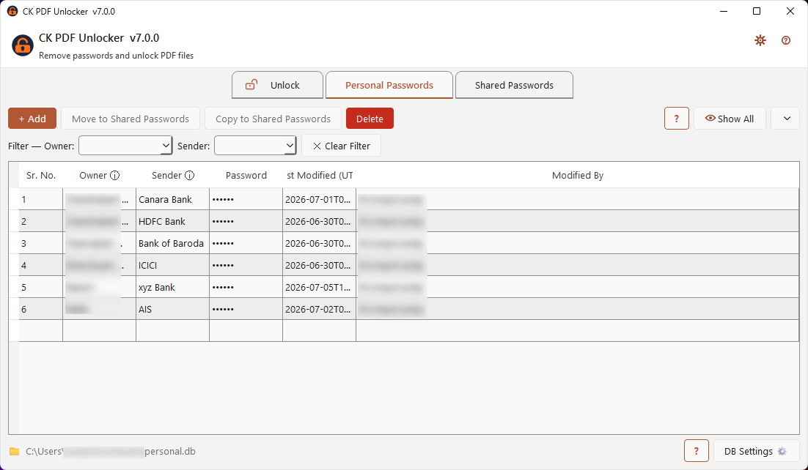
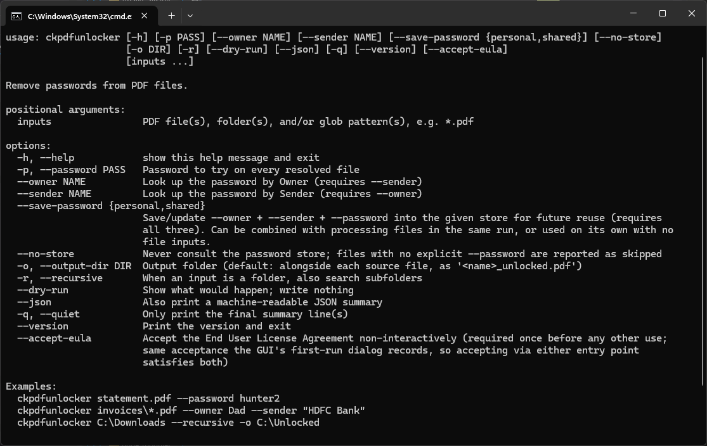

# 🔓 CK PDF Unlocker

<p align="center">
  
</p>

**Stop re-entering passwords. Remove passwords and copy/print restrictions from PDF files — safely, locally, and without changing your originals.**

> ⚠️ **This app does NOT crack or recover passwords.** It cannot find or guess a lost password.
> It is designed solely to eliminate the hassle of re-entering a **known password** every time you open a PDF you already have legitimate access to.

[](https://github.com/epatels/ck-pdf-unlocker/releases/latest)
[](#requirements)
[-lightgrey)](#license)
[](https://epatels.github.io/ck-pdf-unlocker/)

### 🌐 [epatels.github.io/ck-pdf-unlocker](https://epatels.github.io/ck-pdf-unlocker/)

---

## 🆕 What's New in v7.0 — Enter a Password Once. Never Again.

This is a **major release**. The single biggest change: CK PDF Unlocker now **remembers every password you use** and **auto-fills it the next time** — no more digging through emails or sticky notes for a password you've typed a hundred times before.

| | |
|---|---|
| 🔐 **Save once, unlock forever** | The first time you unlock a file, its password is saved automatically. The next file from the same sender unlocks itself. |
| 🧠 **Smart, self-learning auto-fill** | The app reads each filename and learns which **Owner** and **Sender** it belongs to — the more you use it, the fewer clicks each new batch takes. |
| 🗂️ **Personal & Shared Password Vaults** | Keep your own private vault, or a shared one for a household/team — encrypted, backed up daily, and automatically conflict-free. |
| ⌨️ **New CLI** | `ckpdfunlocker` — script or automate unlocking from the command line, using the very same Vault and auto-fill logic as the desktop app. |

---

## 100% Free — No Strings Attached

| | |
|---|---|
| ✅ **Completely free** | No payment, no subscription, no trial |
| ✅ **Offline** | File does not leave your device |
| ✅ **No registration** | No account, no email, no credit card, no phone |
| ✅ **No ads** | Clean, distraction-free interface |
| ✅ **No malware or spyware** | Every release is independently scanned by VirusTotal — see [Security](#-security--virustotal-verification) below |
| ✅ **No expiry** | Download once, use forever |
| ✅ **No Watermark** | Absolutely no restrictions |
| ✅ **Commercial use allowed** | Use it for your business without restrictions |
| ✅ **Original files untouched** | A new `_unlocked.pdf` is always created — originals are never modified |

---

## What It Does

CK PDF Unlocker removes two kinds of PDF restrictions:

| Restriction | What it means | After unlocking |
|---|---|---|
| **Open password** | You're prompted for a password just to open the file | File opens freely |
| **Copy / print restrictions** | File opens but you can't copy text, print, or edit | All restrictions lifted |

> **Your original file is never modified.** CK PDF Unlocker always creates a new file alongside the original — named `filename_unlocked.pdf` — or in a folder of your choice. The original stays exactly as it was.

---

## Download & Install — Windows

> ### 👇 Pick **one** option below to download and install CK PDF Unlocker.

| Method | Best for |
|---|---|
| 🏪 [Microsoft Store](#-microsoft-store) | Easiest — auto-updates, sandboxed |
| 📦 [Winget](#-winget) | Windows Package Manager users |
| 💻 [Command Prompt (curl)](#-command-prompt--curl) | Quick install via terminal |
| ⚡ [PowerShell](#-powershell) | Quick install via terminal |
| 🪣 [Scoop](#-scoop) | Scoop users |
| 🍫 [Chocolatey](#-chocolatey) | Chocolatey users |
| ⬇️ [Direct download](#-direct-download) | No terminal, no package manager |

> Looking for Linux? See the [🐧 Linux](#-download--install--linux) section below.

<br>

<details open>
<summary><h3>🏪 Microsoft Store</h3></summary>


[](https://apps.microsoft.com/detail/9NZFZNXPFF15)

Prefer the command line? Open the Store listing directly:

```cmd
start ms-windows-store://pdp/?ProductId=9NZFZNXPFF15
```

</details>

<details>
<summary><h3>📦 Winget</h3></summary>


```cmd
winget install epatels.CKPDFUnlocker
```

> **Note:** This installs the EXE version by default. For the MSI installer — recommended for Enterprise/IT deployment — use:

```cmd
winget install epatels.CKPDFUnlocker --installer-type msi
```

> **Note:** You can also install straight from the Microsoft Store using winget:

```cmd
winget install --id 9NZFZNXPFF15 --source msstore
```

</details>

<details>
<summary><h3>💻 Command Prompt — curl</h3></summary>


**EXE installer:**
```cmd
curl -L -o "%TEMP%\ck-pdf-unlocker-setup-x64.exe" https://github.com/epatels/ck-pdf-unlocker/releases/latest/download/ck-pdf-unlocker-setup-x64.exe && start /wait "" "%TEMP%\ck-pdf-unlocker-setup-x64.exe" /S && echo CK PDF Unlocker installed successfully!
```

**MSI installer:** — for Enterprise users
```cmd
curl -L -o "%TEMP%\ck-pdf-unlocker-setup-x64.msi" https://github.com/epatels/ck-pdf-unlocker/releases/latest/download/ck-pdf-unlocker-setup-x64.msi && msiexec /i "%TEMP%\ck-pdf-unlocker-setup-x64.msi" /qb /norestart && echo CK PDF Unlocker installed successfully!
```

</details>

<details>
<summary><h3>⚡ PowerShell</h3></summary>


**EXE installer:**
```powershell
Invoke-WebRequest -Uri "https://github.com/epatels/ck-pdf-unlocker/releases/latest/download/ck-pdf-unlocker-setup-x64.exe" -OutFile "$env:TEMP\ck-pdf-unlocker-setup-x64.exe"; Start-Process "$env:TEMP\ck-pdf-unlocker-setup-x64.exe" -ArgumentList "/S" -Wait; Write-Host "CK PDF Unlocker installed successfully!" -ForegroundColor Green
```

**MSI installer:** — for Enterprise users
```powershell
Invoke-WebRequest -Uri "https://github.com/epatels/ck-pdf-unlocker/releases/latest/download/ck-pdf-unlocker-setup-x64.msi" -OutFile "$env:TEMP\ck-pdf-unlocker-setup-x64.msi"; Start-Process msiexec -ArgumentList "/i `"$env:TEMP\ck-pdf-unlocker-setup-x64.msi`" /qb /norestart" -Verb RunAs -Wait; Write-Host "CK PDF Unlocker installed successfully!" -ForegroundColor Green
```

</details>

<details>
<summary><h3>🪣 Scoop</h3></summary>


> **Note:** Scoop installs the `.exe` version. If you need the `.msi` installer, use the Command Prompt or PowerShell options above.

```cmd
scoop install ck-pdf-unlocker
```

To update to the latest version:

```cmd
scoop update ck-pdf-unlocker
```

Add the bucket once, if not already done:

```cmd
scoop bucket add epatels https://github.com/epatels/scoop-bucket
```

</details>

<details>
<summary><h3>🍫 Chocolatey</h3></summary>


```cmd
choco install ck-pdf-unlocker
```

> **Note:** The build script automatically prefers the MSI — it only falls back to the EXE if no MSI was uploaded to that GitHub release. There is no `--installer-type` switch like winget's, so you can't choose at install time; if you specifically need one or the other, use the Command Prompt or PowerShell options above instead.

</details>

<details>
<summary><h3>⬇️ Direct download</h3></summary>

| | |
|---|---|
| Recommended for most users | [](https://github.com/epatels/ck-pdf-unlocker/releases/latest/download/ck-pdf-unlocker-setup-x64.exe) |
| For Enterprise / IT deployment | [](https://github.com/epatels/ck-pdf-unlocker/releases/latest/download/ck-pdf-unlocker-setup-x64.msi) |

> **⚠️ Windows SmartScreen warning on first run**
>
> When you first run the app, Windows may show a warning saying *"Windows protected your PC"*. This is expected and completely normal for any new, independently distributed application — it does **not** mean the file is unsafe.
>
> This happens because the `.exe` is not yet code-signed with a commercial certificate (which costs hundreds of dollars per year). The tool is clean and contains no malware or spyware.
>
> To proceed: click **More info** → then click **Run anyway**.

</details>

---

## 🐧 Download & Install — Linux

> ### 👇 Pick **one** option below.

| Method | Best for |
|---|---|
| 📦 [Snap](#-snap) | Ubuntu and other snap-enabled distros — auto-updates |
| 📥 [Flatpak](#-flatpak) | Any modern distro with Flatpak set up |
| 📀 [AppImage](#-appimage) | Portable — runs on any distro, no installation required |

<br>

<details open>
<summary><h3>📦 Snap</h3></summary>


CK PDF Unlocker is published on the [Snap Store](https://snapcraft.io/ck-pdf-unlocker).

```bash
sudo snap install ck-pdf-unlocker
```

Launch the GUI:

```bash
ck-pdf-unlocker
```

Run the CLI — snap namespaces it as `ck-pdf-unlocker.ckpdfunlocker` by default, since the command name differs from the snap name:

```bash
ck-pdf-unlocker.ckpdfunlocker
```

To use the shorter `ckpdfunlocker` instead, set up the alias once (snapd requires this explicit, per-machine step — it can't be done automatically at install time):

```bash
sudo snap alias ck-pdf-unlocker.ckpdfunlocker ckpdfunlocker
```

After that, both forms work:

```bash
ckpdfunlocker
ck-pdf-unlocker.ckpdfunlocker
```

To update:

```bash
sudo snap refresh ck-pdf-unlocker
```

</details>

<details>
<summary><h3>📥 Flatpak</h3></summary>


**Download + install:**
```bash
curl -L -o ck-pdf-unlocker.flatpak https://github.com/epatels/ck-pdf-unlocker/releases/latest/download/ck-pdf-unlocker.flatpak && flatpak install --user ck-pdf-unlocker.flatpak
```

**Run:**
```bash
flatpak run io.github.epatels.CkPdfUnlocker
```

**Update to the latest version** (download a fresh `.flatpak` from the link above, then):
```bash
flatpak install --user --reinstall ck-pdf-unlocker.flatpak
```

> This installs straight from a downloaded file, not from a store — `flatpak update` won't pick up new versions automatically. Repeat the download step above for each new release.

</details>

<details>
<summary><h3>📀 AppImage</h3></summary>


A portable, single-file executable — no installation required. Works on virtually any x86_64 Linux distribution.

**Download + run:**
```bash
curl -L -o ck-pdf-unlocker.AppImage https://github.com/epatels/ck-pdf-unlocker/releases/latest/download/ck-pdf-unlocker.AppImage && chmod +x ck-pdf-unlocker.AppImage && ./ck-pdf-unlocker.AppImage
```

On first run, the AppImage offers to **install itself** — it copies to `~/.local/bin/`, adds an icon and a `.desktop` file so CK PDF Unlocker appears in your application menu. You can decline and just run it portably.

**Update to the latest version:**

Download the new `.AppImage` from the [latest release](https://github.com/epatels/ck-pdf-unlocker/releases/latest) and replace the old file:
```bash
curl -L -o ~/.local/bin/ck-pdf-unlocker.AppImage https://github.com/epatels/ck-pdf-unlocker/releases/latest/download/ck-pdf-unlocker.AppImage && chmod +x ~/.local/bin/ck-pdf-unlocker.AppImage
```

> Your data in `~/Documents/CK PDF Unlocker/` is completely separate from the AppImage file and is never affected by updates.

</details>

---

## 🗑️ Uninstall

<details>
<summary><h3>Windows</h3></summary>

**From Settings:**

Go to **Settings → Apps → Installed apps**, find *CK PDF Unlocker*, and click **Uninstall**.

**From the command line:**

```cmd
:: Winget
winget uninstall epatels.CKPDFUnlocker

:: Scoop
scoop uninstall ck-pdf-unlocker

:: Chocolatey
choco uninstall ck-pdf-unlocker
```

> Microsoft Store installs can be uninstalled from **Settings → Apps** or by right-clicking the app in the Start Menu and selecting **Uninstall**.

</details>

<details>
<summary><h3>Linux — Snap</h3></summary>

```bash
sudo snap remove ck-pdf-unlocker
```

</details>

<details>
<summary><h3>Linux — Flatpak</h3></summary>

```bash
flatpak uninstall io.github.epatels.CkPdfUnlocker
```

To also remove the app data:

```bash
flatpak uninstall --delete-data io.github.epatels.CkPdfUnlocker
```

</details>

<details>
<summary><h3>Linux — AppImage</h3></summary>

If you used the built-in install prompt on first run:

```bash
# Remove the AppImage binary
rm -f ~/.local/bin/ck-pdf-unlocker.AppImage

# Remove the desktop entry and icon
rm -f ~/.local/share/applications/ck-pdf-unlocker.desktop
rm -f ~/.local/share/icons/hicolor/512x512/apps/ck-pdf-unlocker.png

# Remove the install marker
rm -rf ~/.local/share/ck-pdf-unlocker/.appimage-installed

# Refresh the app menu
update-desktop-database ~/.local/share/applications/ 2>/dev/null || true
```

If you ran it portably (never installed), just delete the `.AppImage` file.

> Your data in `~/Documents/CK PDF Unlocker/` is **not** removed by any of the above. Delete that folder manually if you no longer need your Password Vault and settings.

</details>

---

## Who Is It For?

Anyone who receives password-protected or restricted PDFs they legitimately own or have authorisation to access — anywhere in the world. If you've ever had to dig up a password just to open a file you already own, this tool is for you.

### 🏦 Bank Statements
Banks routinely send monthly statements as password-protected PDFs. CK PDF Unlocker lets you unlock them all at once, making them easy to archive, search, and share with your accountant — without hunting for the password every single time.

### 🧾 Utility Bills
Electricity, water, gas, and broadband providers frequently email bills as protected PDFs. Unlocking them lets you copy text for expense claims or print them without restriction.

### 💼 Tax Documents & Government Records
Tax authorities, income portals, and government agencies around the world issue password-protected PDFs — acknowledgements, assessment notices, certificates. Unlock them once and store them freely.

### 🏠 Loan & Insurance Documents
Home loan statements, insurance policy documents, and premium receipts are routinely sent as locked PDFs. Unlock them to combine, annotate, or share with co-applicants or advisers.

### 💳 Credit Card Statements
Monthly credit card statements from most banks are password-protected. Process multiple months in a single run.

### 📊 Salary Slips & HR Documents
Many payroll systems generate password-protected payslips. Unlock them for easy reference during loan applications or tax filing.

### 🏥 Medical Records & Lab Reports
Diagnostic labs and hospitals sometimes send reports as restricted PDFs. Unlock them to share easily with other doctors or insurance providers.

### 📚 Research Papers & Reports
Some downloaded research papers or internal reports have copy restrictions that prevent highlighting or extracting quotes. Remove the restrictions to work with the content normally.

### 🏛️ Regulatory & Compliance Documents
Licences, certificates, and regulatory filings from government portals often come with restrictions. Unlock them for filing, printing, or long-term archival.

---

## Key Features

- 🔐 **Password Vault** — enter a password once and it's saved automatically; the next matching file unlocks without asking
- 🧠 **Smart auto-fill** — auto-detects Owner and Sender from the filename, and gets better the more you use it (see below)
- **Personal & Shared databases** — a private vault for you, plus an optional shared vault for a household or team, with automatic conflict resolution
- **Batch processing** — add as many PDFs as you like and unlock them all in one click
- **Per-file passwords** — each file can have its own password, or use a single global password for all files
- **Original file untouched** — a new `_unlocked` file is always created; the original is never modified or deleted
- **Output folder control** — save unlocked files alongside originals, or choose a custom output folder
- **Dual engine** — uses [pikepdf](https://pikepdf.readthedocs.io/) as the primary engine with [qpdf](https://qpdf.readthedocs.io/) as a fallback for maximum compatibility
- **Drag and drop** — drag PDF files directly into the file list
- ⌨️ **Command-line interface** — `ckpdfunlocker`, for scripting and automation, sharing the same Vault and auto-fill logic as the desktop app
- **Dark / Light / System theme** — choose your preferred theme; it's remembered across sessions
- **Auto-update** — notified in-app when a new version is available, with one-click update
- **Output metadata** — every unlocked PDF is stamped with the tool name, version, timestamp, and a unique document ID for traceability
- **In-app Help Center** — a searchable-by-topic help panel (Help → Help Center, or press `F1`) covering the Vault, auto-fill, CLI, and FAQ
- **Anonymous telemetry** — optional, opt-in only; helps improve the tool (no filenames or passwords ever sent)

---

## 🔐 Smart Password Vault & Auto-fill

The headline feature of this release: **you should never have to type the same PDF password twice.**

### Enter it once — CK PDF Unlocker remembers it

The moment you successfully unlock a file, its password is saved automatically into the Password Vault, keyed by:

- **Owner** — who the document belongs to (e.g. "Dad", "Priya", "Acme Pvt Ltd")
- **Sender** — who issued it (e.g. "HDFC Bank", "State Electricity Board")

The next PDF from that same sender — this month's statement, next quarter's bill — is matched automatically and unlocked without you typing a thing.

### Auto-fill that learns from you

When you add a file, CK PDF Unlocker reads the filename and tries to work out its Owner and Sender on its own. The first time it sees an unfamiliar filename pattern, it may ask you to confirm — after that, it remembers the pattern, so similarly-named files are recognized instantly from then on.

| Session | What happens |
|---|---|
| 1st time you unlock `HDFC_Statement_Jan.pdf` | You confirm Owner + Sender once; password is saved |
| 2nd time (`HDFC_Statement_Feb.pdf`) | Owner, Sender, **and password** are all auto-filled |
| Every month after | Zero clicks — just add the file and hit Unlock |

### Personal Passwords vs. Shared Passwords

| | 🔒 Personal Passwords | 🗂️ Shared Passwords — *for families &amp; teams* |
|---|---|---|
| **Who it's for** | Just you | A household or small team |
| **Where it lives** | Your own device, local only | Point it at a shared or synced folder (e.g. a family NAS, OneDrive, or Google Drive folder) |
| **What you get** | Your own statements, bills, and personal documents unlock themselves | Set a password once — e.g. the electricity board's — and **everyone's** copy of CK PDF Unlocker auto-fills it |
| **Managing entries** | Filter, edit, or delete anytime | Same, plus move/copy entries to or from Personal with one click |
| **Security** | Encrypted at rest, visible only to you | Still encrypted at rest — only people with access to that shared folder can read it |
| **Conflicts** | — | If the same Owner/Sender exists in both vaults, the most recently updated entry wins automatically — no dialog, no interruption |

Switch between them from the **Personal Passwords** / **Shared Passwords** tabs at the top of the window. Each vault lists every saved entry with its **Owner**, **Sender**, **Password**, **Last Modified (UTC)**, and **Modified By** — and you can:

- **+ Add** an entry manually
- **Move to Shared Passwords** / **Copy to Shared Passwords** — promote a personal entry to the shared vault (or vice versa)
- **Delete** an entry you no longer need
- **Filter** by Owner or Sender, with one click to **Clear Filter**
- **Show All** to reset any active filter
- Open **DB Settings** to relocate the database file (e.g. onto a synced/shared drive) or view its path

### Safe by design

- Every password is **encrypted at rest** (AES via Fernet) inside a local SQLite database — never stored in plain text, never uploaded anywhere
- Both vaults are **backed up automatically every day** (last 5 backups kept)
- Auto-fill only ever reuses Owner/Sender pairs and passwords **you've personally confirmed** — nothing is guessed or scraped from the file's contents
- Import/export either vault to/from Excel (`.xlsx`) for bulk setup or backup

---

## Demo

[](https://app.heygen.com/embeds/013cde5f06db4b098a05ad1bda413843)

---

## Screenshots
<table>
  <tr>
    <td width="33%"><br><sub align="center">Add files — Owner, Sender, and Password auto-fill as you type, keyed to the Password Vault</sub></td>
    <td width="33%"><br><sub align="center">A successful unlock — restrictions detected, password saved, output logged</sub></td>
    <td width="33%"><br><sub align="center">Personal Passwords vault — filter, move/copy to Shared, and manage every saved entry</sub></td>
  </tr>
  <tr>
    <td width="33%"><br><sub align="center"><code>ckpdfunlocker</code> — the new CLI, sharing the same Vault as the desktop app</sub></td>
    <td width="33%"><br><sub align="center">The in-app Help Center (Help → Help Center, or <code>F1</code>)</sub></td>
    <td width="33%"></td>
  </tr>
</table>

---

## How to Use

### Basic — single file

1. Launch the app
2. Click **+ Add Files** (or double-click the file list area, or drag and drop)
3. Select your PDF
4. If the file has an open password, enter it in the **Password** column — or let auto-fill do it for you
5. Click **Unlock PDF(s) →**
6. The unlocked file is saved as `yourfile_unlocked.pdf` in the same folder

> **Your original file is not changed.** A brand new unlocked copy is created. You can delete it, keep both, or replace the original manually — the choice is yours.

### Understanding the file table

| Column | Meaning |
|---|---|
| **Owner** | Who the document belongs to (auto-filled or typed) |
| **Sender** | Who issued it, e.g. a bank or utility company (auto-filled or typed) |
| **Password** | The password to try — auto-filled from the Vault when Owner + Sender are recognized |
| **PW** | Shows whether a password was found/looked up for this row |
| **R** | Restrictions detected in the original file (e.g. *Modify, Copy*) |
| **DB** | Which vault (**P**ersonal or **S**hared) this row's password is looked up from / saved to |

### Batch — multiple files

1. Add as many PDFs as you like using **+ Add Files** (or drag and drop multiple files)
2. Enter passwords per file if needed, or use the **Common Password for all PDFs** field and click **Apply to all**
3. Choose an output folder if you want all files saved to one place instead of next to their originals
4. Click **Unlock PDF(s) →**

> If a file named `statement_unlocked.pdf` already exists at the destination, CK PDF Unlocker won't overwrite it — it saves as `statement_unlocked-v2.pdf`, `-v3`, and so on.

### Files with copy/print restrictions only (no open password)

Leave the password field blank. CK PDF Unlocker will strip the restrictions automatically — no password required.

---

## ⌨️ Command-Line Interface (CLI)

New in this release: `ckpdfunlocker`, a full-featured CLI for scripting and automation — built on the same engine, Password Vault, and Smart Auto-fill logic as the desktop app.

```cmd
:: Unlock a single file with a known password
ckpdfunlocker statement.pdf --password hunter2

:: Look up the password in the Vault by Owner + Sender
ckpdfunlocker invoices\*.pdf --owner Dad --sender "HDFC Bank"

:: Unlock an entire folder (and subfolders), auto-matching each file by filename
ckpdfunlocker C:\Downloads --recursive -o C:\Unlocked

:: Save a password to the Vault for future use, without unlocking anything yet
ckpdfunlocker --owner "Priya" --sender "State Electricity Board" --password mypw --save-password personal
```

| Option | Description |
|---|---|
| `inputs` | PDF file(s), folder(s), and/or glob pattern(s), e.g. `*.pdf` |
| `-p, --password PASS` | Password to try on every resolved file |
| `--owner NAME` / `--sender NAME` | Look up the password in the Vault by Owner + Sender (both required together) |
| `--save-password {personal,shared}` | Save/update Owner + Sender + Password into the given vault for future reuse — requires all three, and can be combined with file inputs or run entirely on its own (no files) just to pre-populate the Vault |
| `--no-store` | Never consult the Vault — files with no explicit `--password` are reported as skipped |
| `-o, --output-dir DIR` | Output folder (default: alongside each source file, as `<name>_unlocked.pdf`) |
| `-r, --recursive` | When an input is a folder, also search subfolders |
| `--dry-run` | Show what would happen; write nothing |
| `--json` | Also print a machine-readable JSON summary |
| `-q, --quiet` | Only print the final summary line(s) |
| `--version` | Print the version and exit |
| `--accept-eula` | Accept the license non-interactively (needed once; shared with the desktop app's first-run dialog) |

With no `--password` or `--owner`/`--sender` given, the CLI auto-matches each file by filename against the Vault — the same Smart Auto-fill the desktop app uses — and only applies a match when it's unambiguous. Both the CLI and desktop app read and write the **same** Personal/Shared databases, so anything saved in one shows up instantly in the other.

---

## Output File Naming

| Original file | Unlocked file |
|---|---|
| `statement_jan.pdf` | `statement_jan_unlocked.pdf` |
| `ITR_acknowledgement.pdf` | `ITR_acknowledgement_unlocked.pdf` |
| `salary_slip_march.pdf` | `salary_slip_march_unlocked.pdf` |

If you specify a custom output folder (Step 3), unlocked files are saved there instead of next to the originals.

---

## Requirements

| Component | Details |
|---|---|
| **OS** | Windows 10 or Windows 11, or Linux (via Snap, Flatpak, or AppImage — see [Linux install](#-download--install--linux)) |
| **Runtime** | None — everything is bundled (the CLI, `ckpdfunlocker`, is included alongside the GUI on every platform) |
| **qpdf** | Downloaded automatically if needed on Windows; bundled directly in the Snap/Flatpak/AppImage builds |

---

## Privacy & Telemetry

On first launch, CK PDF Unlocker asks if you'd like to share **anonymous usage statistics** to help improve the tool.

**What is sent (if you opt in):**
- App version
- Operating system name and version
- Number of files processed per run
- Success/failure count
- Processing time

**What is never sent — ever:**
- Filenames
- File paths
- Passwords
- File contents
- Any personally identifiable information

You can change your preference at any time via **Theme → Settings**.


---

## How It Works

CK PDF Unlocker uses two industry-standard open-source PDF libraries:

1. **pikepdf** (primary) — a Python library built on QPDF that handles most standard PDF encryption schemes
2. **qpdf** (fallback) — used when pikepdf alone cannot remove a particular encryption layer


---

## Feedback & Suggestions

Found a bug? Have an idea for a new feature? Your feedback is welcome and helps make the tool better.

- 🐛 **Report a bug** → [Open a bug report](https://github.com/epatels/ck-pdf-unlocker/issues/new?template=bug_report.md)
- 💬 **Suggest a feature** → [Open a feature request](https://github.com/epatels/ck-pdf-unlocker/issues/new?template=feature_request.md)
- 📋 **Browse existing issues** → [Issues page](https://github.com/epatels/ck-pdf-unlocker/issues)

---

## Frequently Asked Questions

**Is this legal?**
Yes, if you are unlocking PDFs that you own or have a legitimate right to access. Removing restrictions from your own bank statements, utility bills, or tax documents is entirely lawful. Do not use this tool to bypass protections on documents you do not own or are not authorised to access.

**Will my original file be changed?**
No. CK PDF Unlocker never modifies the original file. It always creates a new file ending in `_unlocked.pdf`.

**What if I enter the wrong password?**
The tool will report a failure for that file in the log. The original file is not affected. Correct the password and try again.

**What PDF encryption types are supported?**
RC4 (40-bit and 128-bit) and AES (128-bit and 256-bit) — the full range used by standard PDF producers including banks, government portals, and office software.

**Can it unlock PDFs without a password (copy/print restrictions only)?**
Yes. If a PDF opens freely but has printing or copying disabled, leave the password field blank and click Unlock. The restrictions will be removed.

**Does it work on scanned PDFs?**
Yes — the encryption wrapper is removed regardless of whether the PDF contains text or scanned images.

**Is my saved password safe?**
Yes. The Password Vault encrypts every password before it touches disk (AES via Fernet), and nothing is ever sent off your device.

**What if Smart Auto-fill picks the wrong Owner or Sender?**
Just correct it once in the row — that correction is exactly what the app learns from, so future files with a similar filename improve.

**Does the CLI share the same Vault as the desktop app?**
Yes — both read and write the same Personal/Shared databases, so a password saved in one is instantly available in the other.

---

<!-- VT-SECTION-START -->
## 🛡️ Security — VirusTotal Verification

Release `v7.2.5` assets have been independently scanned by VirusTotal. Click a link below to view the live scan results:

| Installer | VirusTotal Result |
|-----------|-------------------|
| `.exe` (recommended) | [View scan ↗](https://www.virustotal.com/gui/url/aHR0cHM6Ly9naXRodWIuY29tL2VwYXRlbHMvY2stcGRmLXVubG9ja2VyL3JlbGVhc2VzL2Rvd25sb2FkL3Y3LjIuNS9jay1wZGYtdW5sb2NrZXItc2V0dXAteDY0LmV4ZQ) |
| `.msi` (enterprise)  | [View scan ↗](https://www.virustotal.com/gui/url/aHR0cHM6Ly9naXRodWIuY29tL2VwYXRlbHMvY2stcGRmLXVubG9ja2VyL3JlbGVhc2VzL2Rvd25sb2FkL3Y3LjIuNS9jay1wZGYtdW5sb2NrZXItc2V0dXAteDY0Lm1zaQ) |

> Scans are submitted automatically on each release. Results reflect the file at the GitHub release download URL.

<!-- VT-SECTION-END -->

---

## License

CK PDF Unlocker is proprietary, freeware software — free to use, including for commercial use, but not open source. Use is governed by an End-User License Agreement (EULA); a copy is provided as [LICENSE](LICENSE). Redistribution, modification, and reverse engineering are not permitted — see the EULA for full terms.

---

## Acknowledgements

- [pikepdf](https://github.com/pikepdf/pikepdf) — the core PDF processing library
- [qpdf](https://github.com/qpdf/qpdf) — the underlying C++ PDF engine
- [PostHog](https://posthog.com) — open-source product analytics

---

*Built with ❤️ by [epatels](https://github.com/epatels) · [epatels.github.io/ck-pdf-unlocker](https://epatels.github.io/ck-pdf-unlocker/)*
