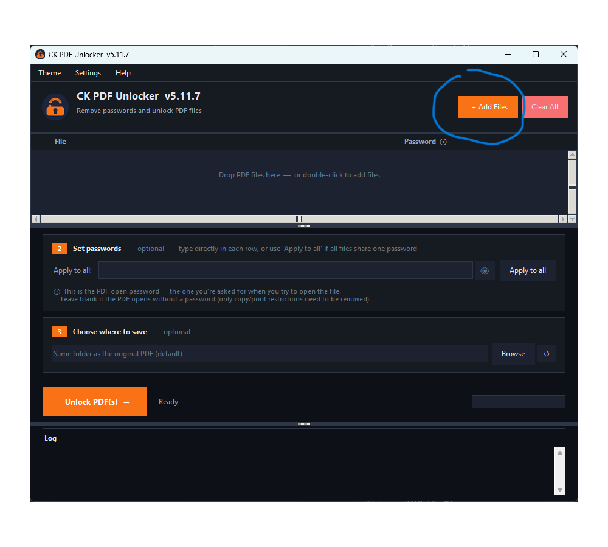
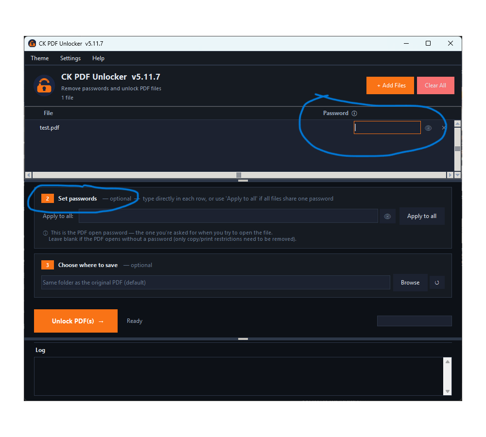
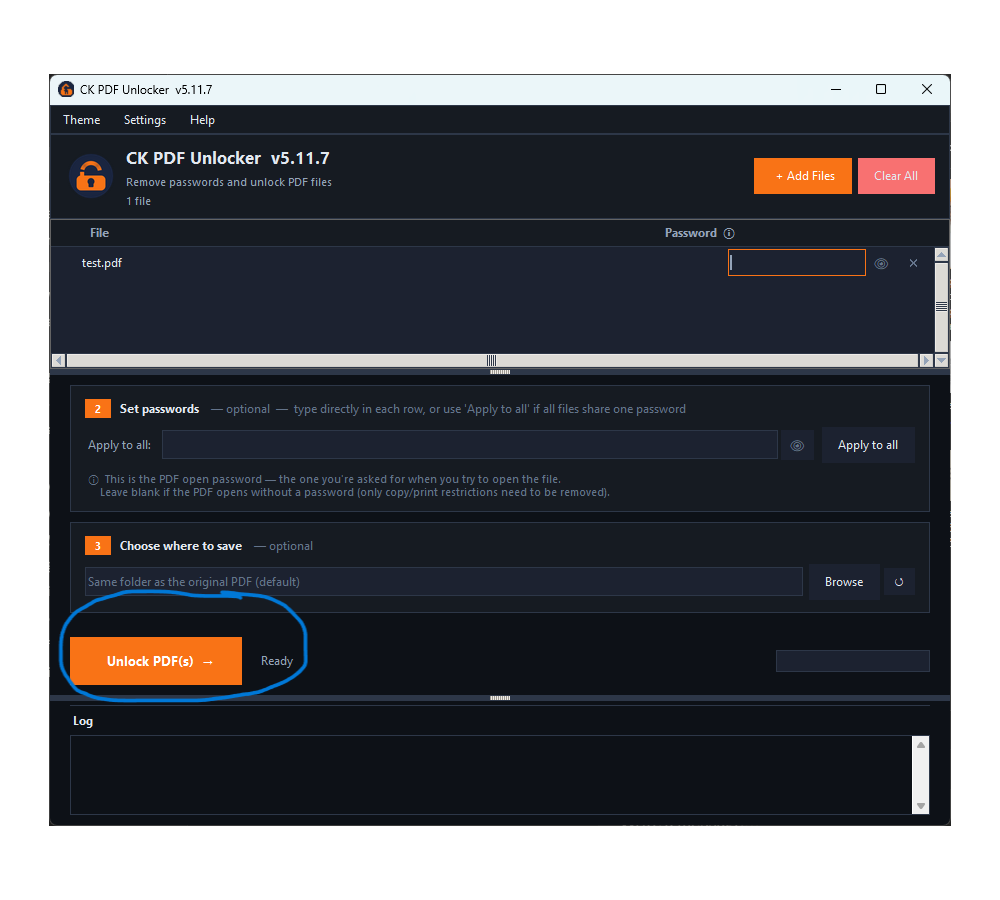

# 🔓 CK PDF Unlocker

<p align="center">
  
</p>

**Stop re-entering passwords. Remove passwords and copy/print restrictions from PDF files — safely, locally, and without changing your originals.**

> ⚠️ **This app does NOT crack or recover passwords.** It cannot find or guess a lost password.
> It is designed solely to eliminate the hassle of re-entering a **known password** every time you open a PDF you already have legitimate access to.

[](https://github.com/epatels/ck-pdf-unlocker/releases/latest)
[](#requirements)
[](#license)
[](https://epatels.github.io/ck-pdf-unlocker/)

### 🌐 [epatels.github.io/ck-pdf-unlocker](https://epatels.github.io/ck-pdf-unlocker/)

---

## 100% Free — No Strings Attached

| | |
|---|---|
| ✅ **Completely free** | No payment, no subscription, no trial |
| ✅ **Offline** | File does not leave your device |
| ✅ **No registration** | No account, no email, no credit card, no phone |
| ✅ **No ads** | Clean, distraction-free interface |
| ✅ **No malware or spyware** | Open-source build process, source available on request |
| ✅ **No expiry** | Download once, use forever |
| ✅ **No Watermark** | Absolutely no restrictions |
| ✅ **Commercial use allowed** | Use it for your business without restrictions |
| ✅ **Original files untouched** | A new `_unlocked.pdf` is always created — originals are never modified |

---

## What It Does

CK PDF Unlocker removes two kinds of PDF restrictions:

| Restriction | What it means | After unlocking |
|---|---|---|
| **Open password** | You're prompted for a password just to open the file | File opens freely |
| **Copy / print restrictions** | File opens but you can't copy text, print, or edit | All restrictions lifted |

> **Your original file is never modified.** CK PDF Unlocker always creates a new file alongside the original — named `filename_unlocked.pdf` — or in a folder of your choice. The original stays exactly as it was.

---

## Download & Install

> ### 👇 Pick **one** option below to download and install CK PDF Unlocker.

| Method | Best for |
|---|---|
| 🏪 [Microsoft Store](#-microsoft-store) | Easiest — auto-updates, sandboxed |
| 💻 [Command Prompt (curl)](#-command-prompt--curl) | Quick install via terminal |
| ⚡ [PowerShell](#-powershell) | Quick install via terminal |
| 🪣 [Scoop](#-scoop) | Scoop users |
| 📦 [Winget](#-winget) | Windows Package Manager users |
| 🍫 [Chocolatey](#-chocolatey) | Chocolatey users |
| ⬇️ [Direct download](#-direct-download) | No terminal, no package manager |

<br>

<details open>
<summary><h3>🏪 Microsoft Store</h3></summary>


[](https://apps.microsoft.com/detail/9NZFZNXPFF15)

Prefer the command line? Open the Store listing directly:

```cmd
start ms-windows-store://pdp/?ProductId=9NZFZNXPFF15
```

</details>

<details>
<summary><h3>💻 Command Prompt — curl</h3></summary>


**EXE installer:**
```cmd
curl -L -o "%TEMP%\ck-pdf-unlocker-setup-x64.exe" https://github.com/epatels/ck-pdf-unlocker/releases/latest/download/ck-pdf-unlocker-setup-x64.exe && start /wait "" "%TEMP%\ck-pdf-unlocker-setup-x64.exe" /S && echo CK PDF Unlocker installed successfully!
```

**MSI installer:** — for Enterprise users
```cmd
curl -L -o "%TEMP%\ck-pdf-unlocker-setup-x64.msi" https://github.com/epatels/ck-pdf-unlocker/releases/latest/download/ck-pdf-unlocker-setup-x64.msi && msiexec /i "%TEMP%\ck-pdf-unlocker-setup-x64.msi" /qb /norestart && echo CK PDF Unlocker installed successfully!
```

</details>

<details>
<summary><h3>⚡ PowerShell</h3></summary>


**EXE installer:**
```powershell
Invoke-WebRequest -Uri "https://github.com/epatels/ck-pdf-unlocker/releases/latest/download/ck-pdf-unlocker-setup-x64.exe" -OutFile "$env:TEMP\ck-pdf-unlocker-setup-x64.exe"; Start-Process "$env:TEMP\ck-pdf-unlocker-setup-x64.exe" -ArgumentList "/S" -Wait; Write-Host "CK PDF Unlocker installed successfully!" -ForegroundColor Green
```

**MSI installer:** — for Enterprise users
```powershell
Invoke-WebRequest -Uri "https://github.com/epatels/ck-pdf-unlocker/releases/latest/download/ck-pdf-unlocker-setup-x64.msi" -OutFile "$env:TEMP\ck-pdf-unlocker-setup-x64.msi"; Start-Process msiexec -ArgumentList "/i `"$env:TEMP\ck-pdf-unlocker-setup-x64.msi`" /qb /norestart" -Verb RunAs -Wait; Write-Host "CK PDF Unlocker installed successfully!" -ForegroundColor Green
```

</details>

<details>
<summary><h3>🪣 Scoop</h3></summary>


> **Note:** Scoop installs the `.exe` version. If you need the `.msi` installer, use the Command Prompt or PowerShell options above.

Add the bucket once, if not already done:

```cmd
scoop bucket add epatels https://github.com/epatels/scoop-bucket
```

```cmd
scoop install ck-pdf-unlocker
```

To update to the latest version:

```cmd
scoop update ck-pdf-unlocker
```

</details>

<details>
<summary><h3>📦 Winget</h3></summary>


```cmd
winget install epatels.CKPDFUnlocker
```

> **Note:** This installs the EXE version by default. For the MSI installer — recommended for Enterprise/IT deployment — use:

```cmd
winget install epatels.CKPDFUnlocker --installer-type msi
```

> **Note:** You can also install straight from the Microsoft Store using winget:

```cmd
winget install --id 9NZFZNXPFF15 --source msstore
```

</details>

<details>
<summary><h3>🍫 Chocolatey</h3></summary>


```cmd
choco install ck-pdf-unlocker
```

> **Note:** This installs whichever installer was published for the current release — the MSI if one was built, otherwise the EXE. There is no `--installer-type` switch like winget's; if you specifically need the MSI, use the Command Prompt or PowerShell options above instead.

</details>

<details>
<summary><h3>⬇️ Direct download</h3></summary>

| | |
|---|---|
| Recommended for most users | [](https://github.com/epatels/ck-pdf-unlocker/releases/latest/download/ck-pdf-unlocker-setup-x64.exe) |
| For Enterprise / IT deployment | [](https://github.com/epatels/ck-pdf-unlocker/releases/latest/download/ck-pdf-unlocker-setup-x64.msi) |

> **⚠️ Windows SmartScreen warning on first run**
>
> When you first run the app, Windows may show a warning saying *"Windows protected your PC"*. This is expected and completely normal for any new, independently distributed application — it does **not** mean the file is unsafe.
>
> This happens because the `.exe` is not yet code-signed with a commercial certificate (which costs hundreds of dollars per year). The tool is clean and contains no malware or spyware.
>
> To proceed: click **More info** → then click **Run anyway**.

</details>

---

## Who Is It For?

Anyone who receives password-protected or restricted PDFs they legitimately own or have authorisation to access — anywhere in the world. If you've ever had to dig up a password just to open a file you already own, this tool is for you.

### 🏦 Bank Statements
Banks routinely send monthly statements as password-protected PDFs. CK PDF Unlocker lets you unlock them all at once, making them easy to archive, search, and share with your accountant — without hunting for the password every single time.

### 🧾 Utility Bills
Electricity, water, gas, and broadband providers frequently email bills as protected PDFs. Unlocking them lets you copy text for expense claims or print them without restriction.

### 💼 Tax Documents & Government Records
Tax authorities, income portals, and government agencies around the world issue password-protected PDFs — acknowledgements, assessment notices, certificates. Unlock them once and store them freely.

### 🏠 Loan & Insurance Documents
Home loan statements, insurance policy documents, and premium receipts are routinely sent as locked PDFs. Unlock them to combine, annotate, or share with co-applicants or advisers.

### 💳 Credit Card Statements
Monthly credit card statements from most banks are password-protected. Process multiple months in a single run.

### 📊 Salary Slips & HR Documents
Many payroll systems generate password-protected payslips. Unlock them for easy reference during loan applications or tax filing.

### 🏥 Medical Records & Lab Reports
Diagnostic labs and hospitals sometimes send reports as restricted PDFs. Unlock them to share easily with other doctors or insurance providers.

### 📚 Research Papers & Reports
Some downloaded research papers or internal reports have copy restrictions that prevent highlighting or extracting quotes. Remove the restrictions to work with the content normally.

### 🏛️ Regulatory & Compliance Documents
Licences, certificates, and regulatory filings from government portals often come with restrictions. Unlock them for filing, printing, or long-term archival.

---

## Key Features

- **Batch processing** — add as many PDFs as you like and unlock them all in one click
- **Per-file passwords** — each file can have its own password, or use a single global password for all files
- **Original file untouched** — a new `_unlocked` file is always created; the original is never modified or deleted
- **Output folder control** — save unlocked files alongside originals, or choose a custom output folder
- **Dual engine** — uses [pikepdf](https://pikepdf.readthedocs.io/) as the primary engine with [qpdf](https://qpdf.readthedocs.io/) as a fallback for maximum compatibility
- **Drag and drop** — drag PDF files directly into the file list
- **Dark / Light / System theme** — choose your preferred theme; it's remembered across sessions
- **Auto-update** — notified in-app when a new version is available, with one-click update
- **Output metadata** — every unlocked PDF is stamped with the tool name, version, timestamp, and a unique document ID for traceability
- **Anonymous telemetry** — optional, opt-in only; helps improve the tool (no filenames or passwords ever sent)

---

## Demo

[](https://app.heygen.com/embeds/013cde5f06db4b098a05ad1bda413843)

---

## Screenshots
<table>
  <tr>
    <td></td>
    <td></td>
    <td></td>
  </tr>
</table>

---

## How to Use

### Basic — single file

1. Launch the app
2. Click **+ Add Files** (or double-click the file list area, or drag and drop)
3. Select your PDF
4. If the file has an open password, enter it in the **Password** column
5. Click **🔓 Unlock PDF**
6. The unlocked file is saved as `yourfile_unlocked.pdf` in the same folder

> **Your original file is not changed.** A brand new unlocked copy is created. You can delete it, keep both, or replace the original manually — the choice is yours.

### Batch — multiple files

1. Add as many PDFs as you like using **+ Add Files** (or drag and drop multiple files)
2. Enter passwords per file if needed, or use the **Global Password** field if all files share the same password
3. Choose an output folder under **Step 3** if you want all files saved to one place
4. Click **🔓 Unlock PDF**

### Files with copy/print restrictions only (no open password)

Leave the password field blank. CK PDF Unlocker will strip the restrictions automatically — no password required.

---

## Output File Naming

| Original file | Unlocked file |
|---|---|
| `statement_jan.pdf` | `statement_jan_unlocked.pdf` |
| `ITR_acknowledgement.pdf` | `ITR_acknowledgement_unlocked.pdf` |
| `salary_slip_march.pdf` | `salary_slip_march_unlocked.pdf` |

If you specify a custom output folder (Step 3), unlocked files are saved there instead of next to the originals.

---

## Requirements

| Component | Details |
|---|---|
| **OS** | Windows 10 or Windows 11 |
| **Runtime** | None — everything is bundled in the `.exe` |
| **qpdf** | Downloaded automatically if needed (no action required) |

---

## Privacy & Telemetry

On first launch, CK PDF Unlocker asks if you'd like to share **anonymous usage statistics** to help improve the tool.

**What is sent (if you opt in):**
- App version
- Operating system name and version
- Number of files processed per run
- Success/failure count
- Processing time

**What is never sent — ever:**
- Filenames
- File paths
- Passwords
- File contents
- Any personally identifiable information

You can change your preference at any time via **Theme → Settings**.


---

## How It Works

CK PDF Unlocker uses two industry-standard open-source PDF libraries:

1. **pikepdf** (primary) — a Python library built on QPDF that handles most standard PDF encryption schemes
2. **qpdf** (fallback) — used when pikepdf alone cannot remove a particular encryption layer


---

## Feedback & Suggestions

Found a bug? Have an idea for a new feature? Your feedback is welcome and helps make the tool better.

- 🐛 **Report a bug** → [Open a bug report](https://github.com/epatels/ck-pdf-unlocker/issues/new?template=bug_report.md)
- 💬 **Suggest a feature** → [Open a feature request](https://github.com/epatels/ck-pdf-unlocker/issues/new?template=feature_request.md)
- 📋 **Browse existing issues** → [Issues page](https://github.com/epatels/ck-pdf-unlocker/issues)

---

## Frequently Asked Questions

**Is this legal?**
Yes, if you are unlocking PDFs that you own or have a legitimate right to access. Removing restrictions from your own bank statements, utility bills, or tax documents is entirely lawful. Do not use this tool to bypass protections on documents you do not own or are not authorised to access.

**Will my original file be changed?**
No. CK PDF Unlocker never modifies the original file. It always creates a new file ending in `_unlocked.pdf`.

**What if I enter the wrong password?**
The tool will report a failure for that file in the log. The original file is not affected. Correct the password and try again.

**What PDF encryption types are supported?**
RC4 (40-bit and 128-bit) and AES (128-bit and 256-bit) — the full range used by standard PDF producers including banks, government portals, and office software.

**Can it unlock PDFs without a password (copy/print restrictions only)?**
Yes. If a PDF opens freely but has printing or copying disabled, leave the password field blank and click Unlock. The restrictions will be removed.

**Does it work on scanned PDFs?**
Yes — the encryption wrapper is removed regardless of whether the PDF contains text or scanned images.

---

<!-- VT-SECTION-START -->
## 🛡️ Security — VirusTotal Verification

Release `6.5.5` assets have been independently scanned by VirusTotal. Click a link below to view the live scan results:

| Installer | VirusTotal Result |
|-----------|-------------------|
| `.exe` (recommended) | [View scan ↗](https://www.virustotal.com/gui/url/aHR0cHM6Ly9naXRodWIuY29tL2VwYXRlbHMvY2stcGRmLXVubG9ja2VyL3JlbGVhc2VzL2Rvd25sb2FkLzYuNS41L2NrLXBkZi11bmxvY2tlci1zZXR1cC5leGU) |
| `.msi` (enterprise)  | [View scan ↗](https://www.virustotal.com/gui/url/aHR0cHM6Ly9naXRodWIuY29tL2VwYXRlbHMvY2stcGRmLXVubG9ja2VyL3JlbGVhc2VzL2Rvd25sb2FkLzYuNS41L2NrLXBkZi11bmxvY2tlci1zZXR1cC5tc2k) |

> Scans are submitted automatically on each release. Results reflect the file at the GitHub release download URL.

<!-- VT-SECTION-END -->

---

## License

MIT License. See [LICENSE](LICENSE) for details.

---

## Acknowledgements

- [pikepdf](https://github.com/pikepdf/pikepdf) — the core PDF processing library
- [qpdf](https://github.com/qpdf/qpdf) — the underlying C++ PDF engine
- [PostHog](https://posthog.com) — open-source product analytics

---

*Built with ❤️ by [epatels](https://github.com/epatels) · [epatels.github.io/ck-pdf-unlocker](https://epatels.github.io/ck-pdf-unlocker/)*
